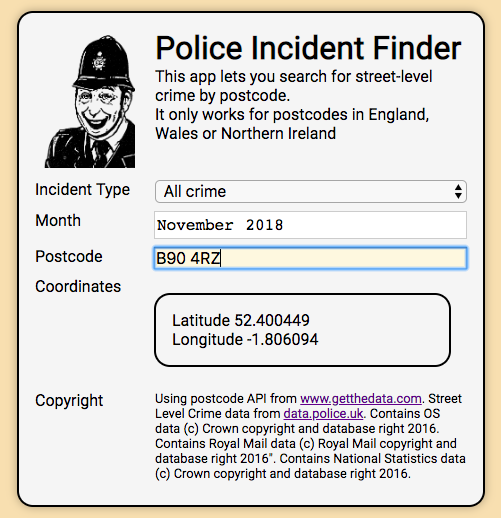
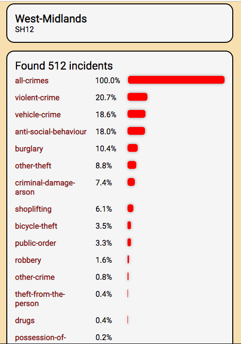
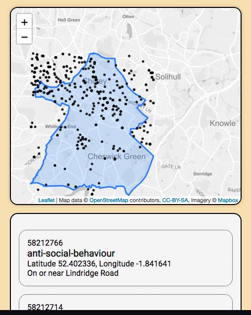

UK Police Data Viewer
=====================

Homework for CodeClan, week 7.

Select a crime type, month/year and postcode, and display a list of street-level crimes in that area.

Uses postcode lookup API to get lat/lon of postcode, then the UK Police API to get the boundary.

Incidents are found using the bounding box of this boundary...

.. and are shown in a Leaflet map and list.

